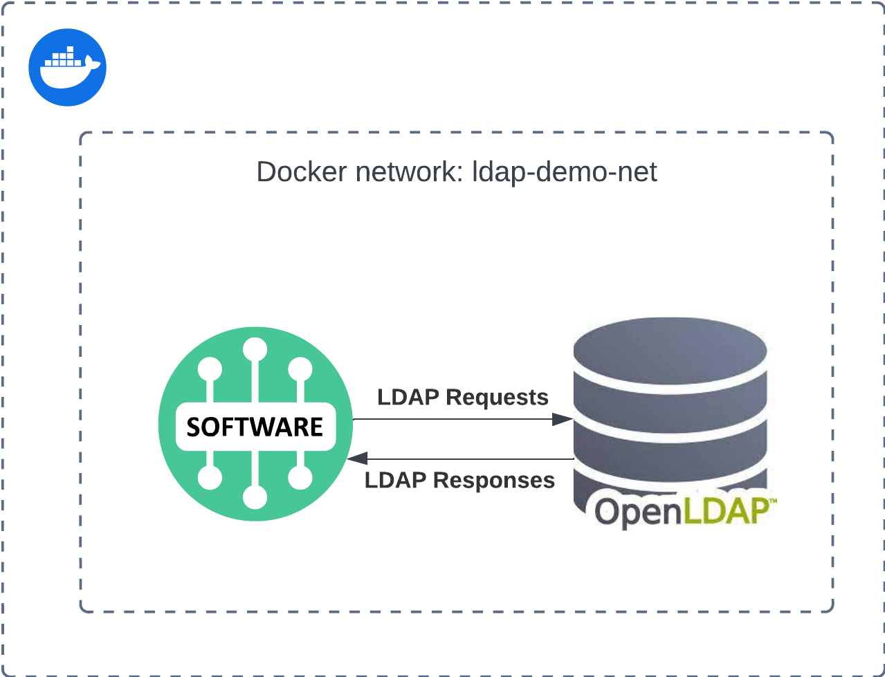

author: hankspencer
summary: This Codelab will walk you through configuring your Solace Event Broker to use LDAP for client authentication and authorization.
id: solace-ldap-configuration
tags: ldap, authentication, authorization, solace, configuration
categories:
environments: Web
status: Published
feedback link: https://github.com/SolaceDev/solace-dev-codelabs/blob/master/markdown/solace-ldap-configuration

# Configuring LDAP Authentication & Authorization

## Introduction

Duration: 0:05:00

Hello!

Did you know that Solace PubSub+ Event Brokers support four different types of authentication schemes for clients trying to 
connect the event broker? These authentication schemes are:
* [Basic Authentication](https://docs.solace.com/Security/Client-Authentication-Overview.htm#Basic-Authentication)
* [Client Certificate Authentication](https://docs.solace.com/Security/Client-Authentication-Overview.htm#Client-Certificate)
* [Kerberos Authentication](https://docs.solace.com/Security/Client-Authentication-Overview.htm#Kerberos)
* [OAuth Authentication](https://docs.solace.com/Security/Client-Authentication-Overview.htm#OAuth)

By default, Basic Authentication is enabled for the event broker, allowing connecting clients to authenticate with an event
broker by providing a valid client username and password as its credentials.

By default, Basic Authentication is configured with an authentication type of _internal_, which means the client username and password
provided by the client are verified against an internal event broker database.

In addition to Internal authentication, Basic Authentication can be configured with the following authentication types:
* RADIUS: The client username and password are sent to an external RADIUS server for authentication.
* LDAP: The client username and password are sent to an external LDAP server for authentication.
* None: No client authentication is performance. Solace **strongly** recommends against using no client authentication.

Customers typically elect to use an external authentication server over the internal option to leverage existing user 
credentials and user groups.

In this codelab you'll learn how to configure a Solace PubSub+ Event Broker to authenticate clients against an external 
LDAP server, how to map clients to authorization groups, and how to assign these authorization groups to specific 
Access Control List (ACL) profiles and Client Profiles.

And most importantly, why you might want to do all of this in the first place!   

## What you'll build

Duration: 0:05:00

As part of this codelab, you'll create both a Solace PubSub+ Event Broker & OpenLDAP server using Docker Compose. The two
containers will be configured to share a network and expose certain ports for access to external apps and clients.



Along the way you'll learn how to use both the Broker Manager UI and the Solace Element Management Protocol (SEMP) to 
configure the event broker.

You'll also learn how to access and use [SDKPerf](https://docs.solace.com/API/SDKPerf/SDKPerf.htm), a tool for 
validating performance, checking broker configuration, and exploring Solace PubSub+ Event Broker features.

## What you need: Prerequisites
Duration: 0:05:00

### Docker

This codelab relies on the use of Docker. If you do not already have Docker installed, you will first need to do that. 
[Docker Desktop](https://www.docker.com/products/docker-desktop/) can be installed for ease of use. At least 4 GiB and 2 cores should be made available for Docker. If more
physical resources are available, providing more may improve your experience (e.g. 8 GiB and 4 cores).

### Source Code
The solace-ldap-demo repository contains the following:
* `docker-compose.yaml` containing the following:
  * Docker image of the Solace PubSub+ Event Broker
  * Docker image of [Bitnami OpenLdap](https://hub.docker.com/r/bitnami/openldap/)
  * .ldiff file configuring the sample user, groups, and attributes for use with the codelab 
  * .schema file ensuring the relevant LDAP modules are enabled.
> aside
> The codelab includes screenshots for configuring LDAP authentication and authorization with event brokers deployed via 
> PubSub+ Cloud where the configuration process differs from PubSub+ Software event brokers. 
> Establishing a connection from event brokers deployed via PubSub+ Cloud to the OpenLDAP server deployed via docker-compose
> is not part of this codelab. 

To get access to the above resources, clone the repository as follows
```shell
git clone git@github.com:spencerhank/solace-ldap-demo.git
```

>aside negative
> If you do not have SSH access conifgured between your local machine and your github account you will receive the following error while cloning.
> `Permission denied (publickey). fatal: Could not read from remote repository.` To avoid that, just clone the https link as follows:
> ```shell
> git clone https://github.com/spencerhank/solace-ldap-demo.git
> ```
   

### SDKPerf
The latest version of SDKPerf can be downloaded [here](https://solace.com/downloads/?fwp_downloads_types=other).
* Additional tool documentation can be found at [SDKPerf](https://docs.solace.com/API/SDKPerf/SDKPerf.htm)

### Optional: Apache Directory Studio
_Not required, screenshots are included in the codelab._

Enables viewing and modification of OpenLDAP server via UI.
> aside
> Throughout the codelab, the respective container name will be used when configuring connections between the Solace PubSub+ Event Broker
> and the OpenLDAP server. This is because they are sharing a docker network. Applications outside of the network, such as Apache Directory Studio
> will reference the service via [protocol]://localhost:[configured_external_port].

## Launch the required containers


> aside negative
> This will appear in a yellow info box.

> aside positive
> This will appear in a green info box.

### Bullets
Plain Text followed by bullets
* Hello
* CodeLab
* World

### Numbered List
1. List
1. Using
1. Numbers

### Add an Image or a GIF


## What you need: Prerequisites

Duration: 0:07:00

Enter environment setup & prerequisites here

### Add a Link
Add a link!
[Example of a Link](https://www.google.com)

### Embed an iframe


## Custom Step 1
## Custom Step 2
## Custom Step 3

## Takeaways

Duration: 0:07:00

✅ < Fill IN TAKEAWAY 1>   
✅ < Fill IN TAKEAWAY 2>   
✅ < Fill IN TAKEAWAY 3>   


Thanks for participating in this codelab! Let us know what you thought in the [Solace Community Forum](https://solace.community/)! If you found any issues along the way we'd appreciate it if you'd raise them by clicking the Report a mistake button at the bottom left of this codelab.
